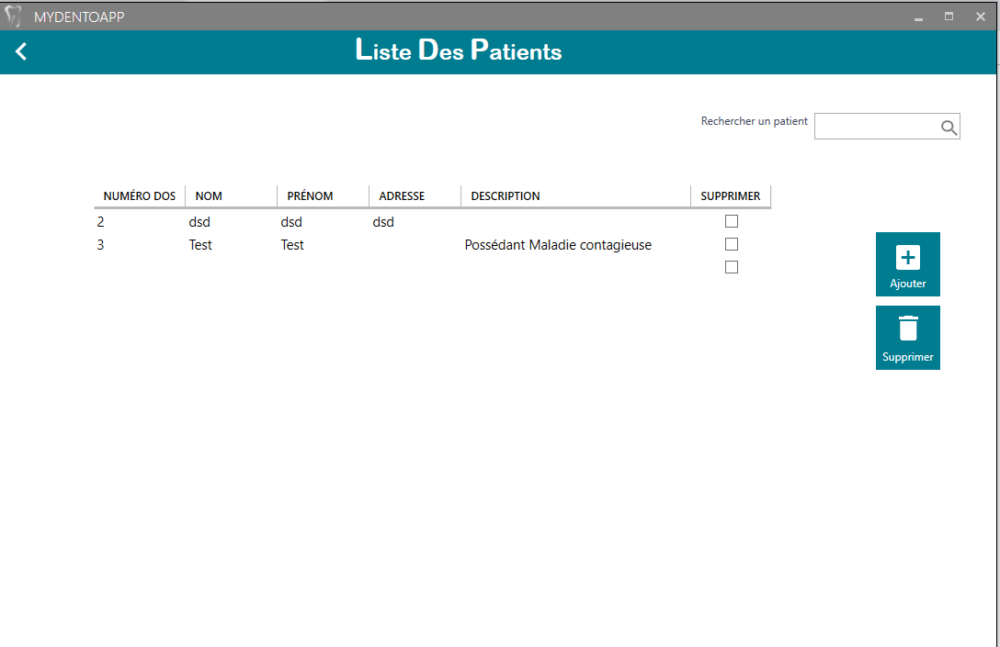
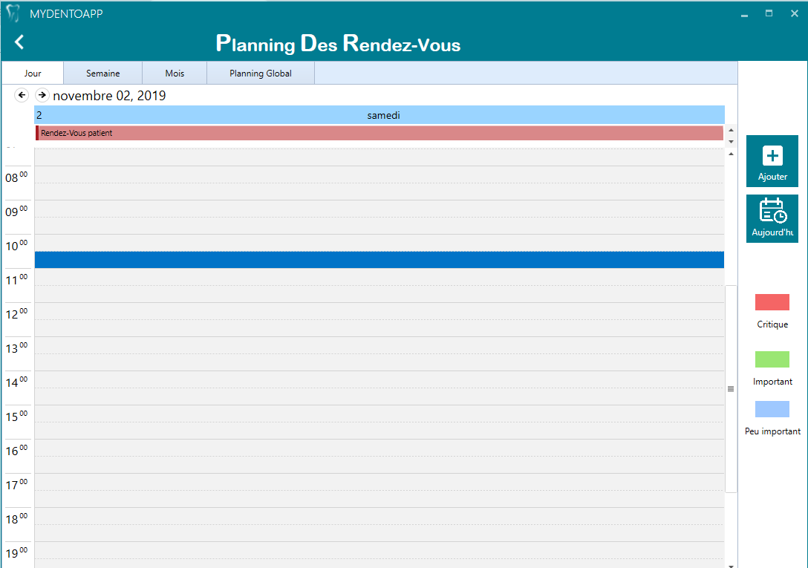
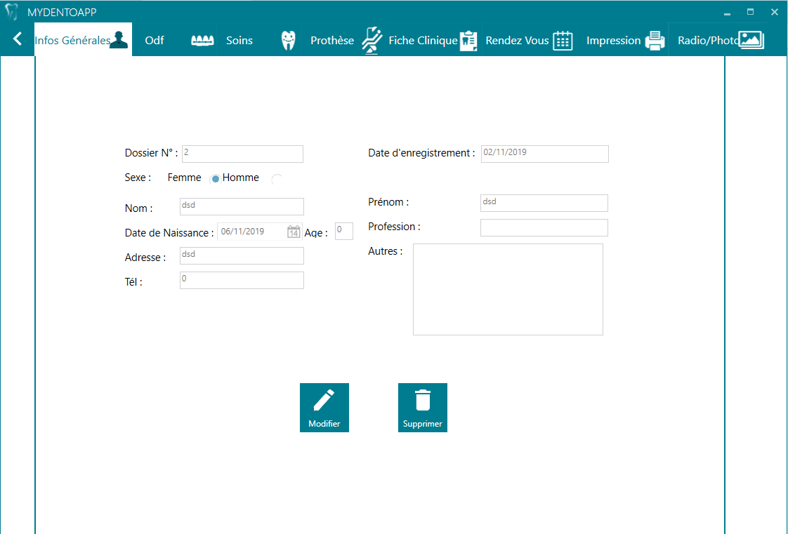
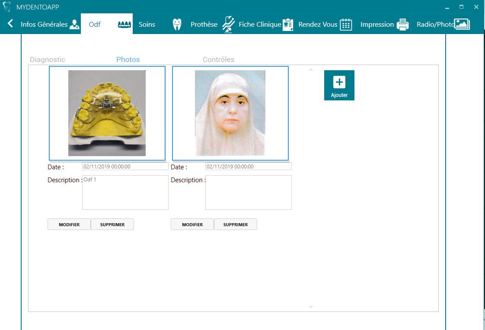
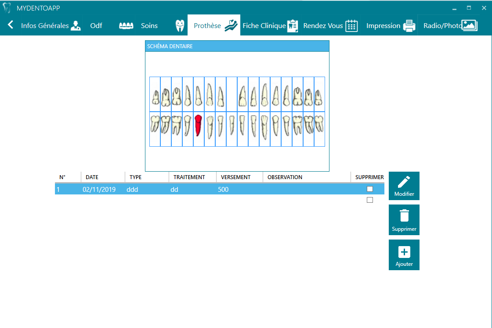
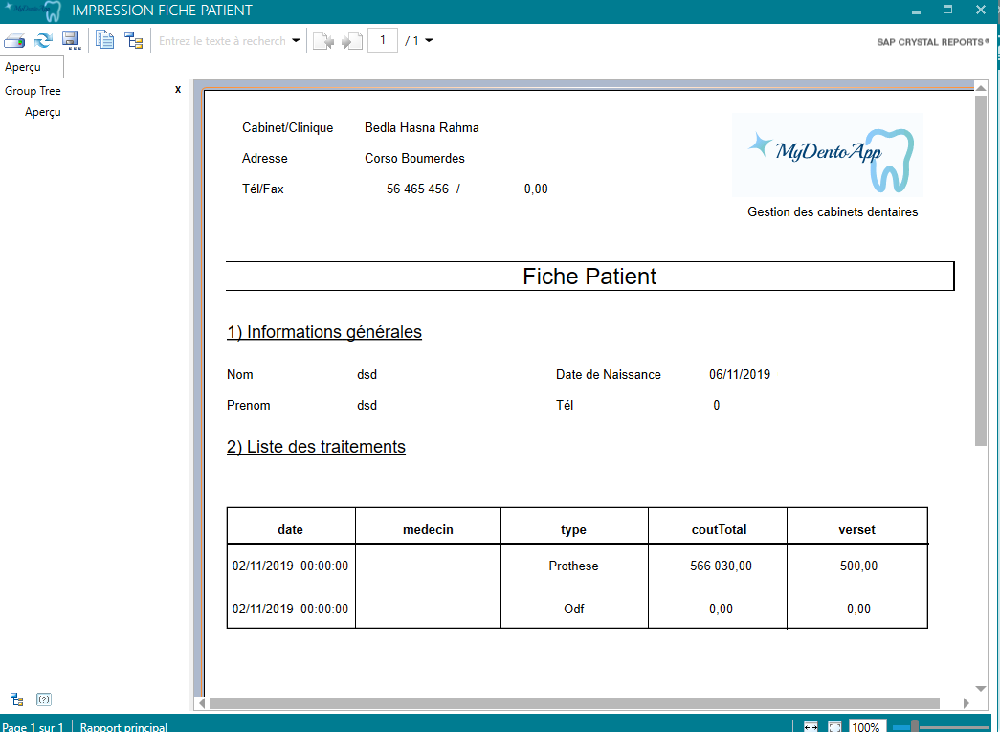
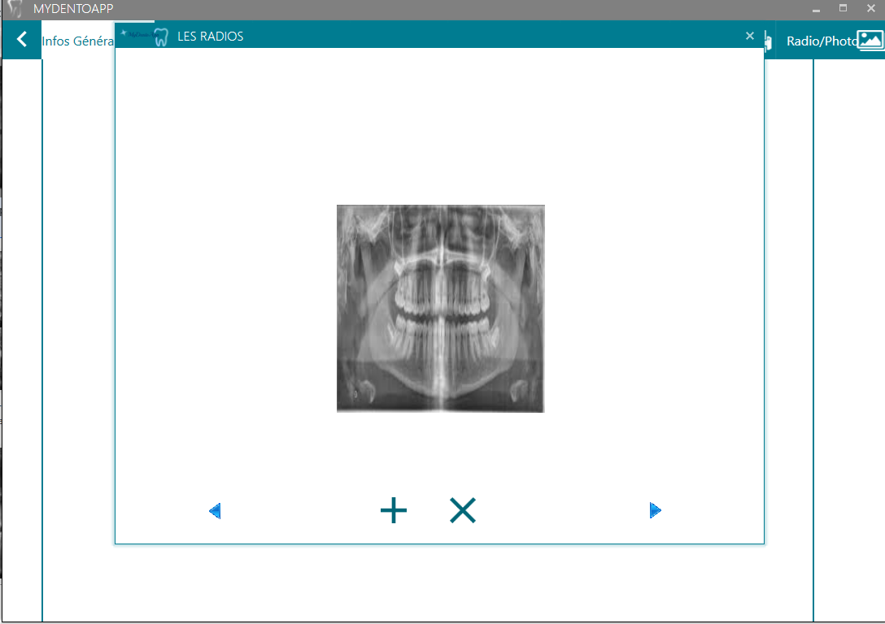
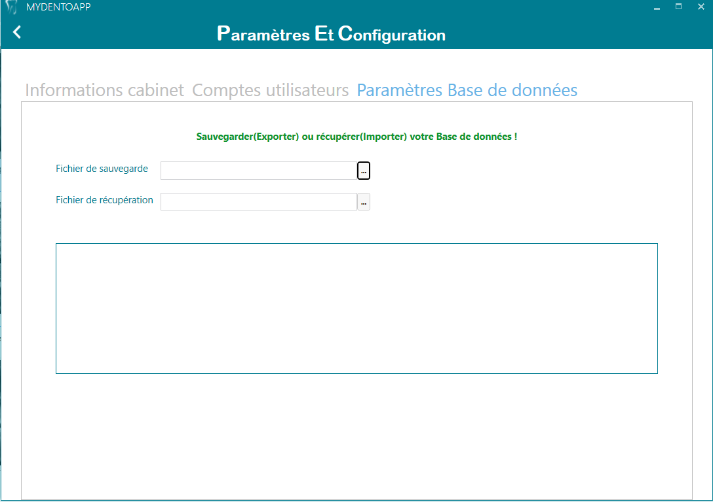
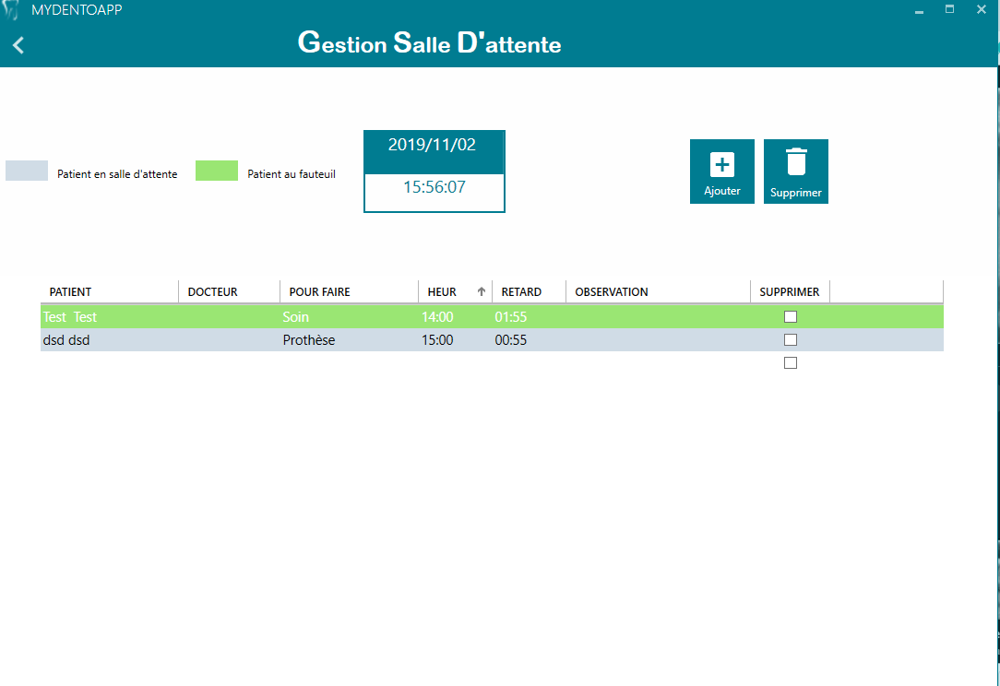

# MyDentoApp
 
MyDentoApp is a Dental Practice Management desktop Software.In principle, it automates all the functions of a doctor within his practice.

# The features provided by the software are:

•	Prosthesis Management
•	Care Management
•	ODF Management
•	Medical Records Management
•	Appointment Management
•	Expenditure Management, Suppliers
•	Import / Export of BDD
•	Patient record printing
•	Printing Ordinances
•	Proof impression
•	advanced search
•	imagery
•	Multi-users (Admin, Doctors, Reception)

# Requirements
  •	Microsoft Windows with .NET framework 4.5.2 or later
  •	Microsoft SQL Server 2008 or later

# Tools Used : 
	Visual Studio C# 
	Sql Server 
	SAP Crystal for Reports 
	
  
# Graphical representation of the interfaces 
 
We will present in the following interafaces some features of my application that uses French as a display language because the target audience in Algeria is French:

 
